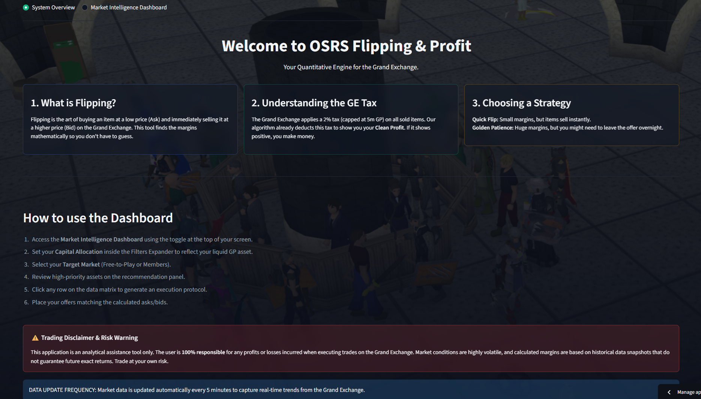
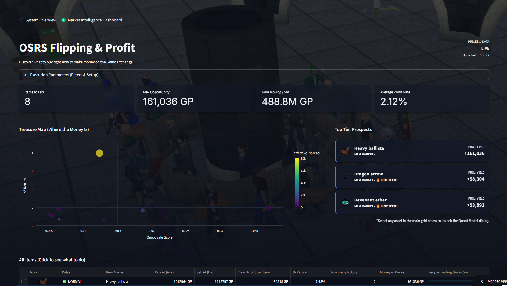
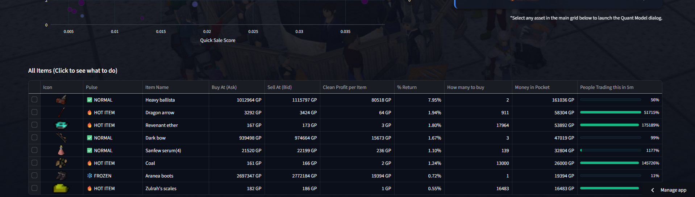
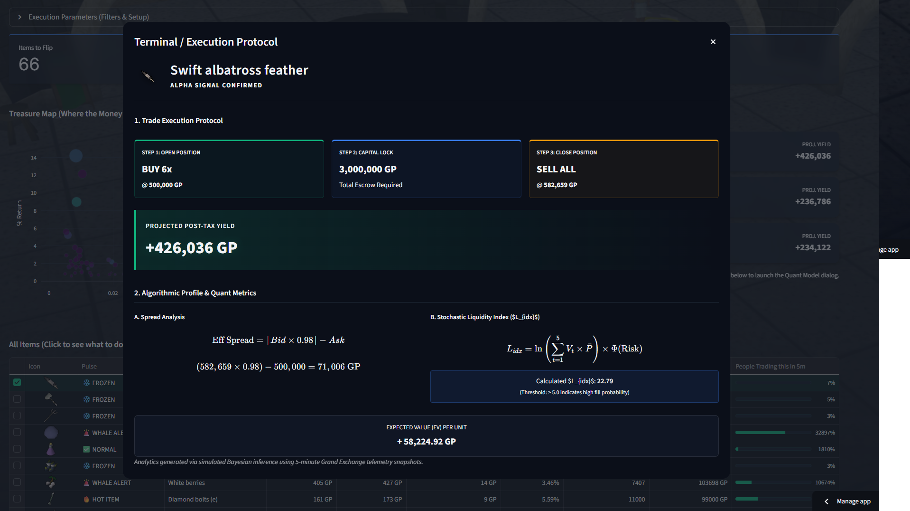

# OSRS Flipping & Quantitative Engine ⚔️📈

A fully automated, end-to-end Data Engineering and Quantitative Analysis pipeline for *Old School RuneScape*. This toolkit extracts real-time Grand Exchange pricing telemetry, applies financial liquidity filters to find profitable arbitrage opportunities ("Flipping"), and serves them via a modern Web Dashboard.

## 📸 Interface Screenshots

### Welcome & Strategy Page


### Market Intelligence & Treasure Map


### Quantitative Flipping Datagrid & Execution Protocol


### Advanced Terminal / Execution Protocol


## 📊 The Quant Execution Terminal

One of the platform's crown jewels is the **Execution Protocol Modal**—a Wall Street-style terminal interface triggered by selecting any asset on the Datagrid. Instead of leaving users guessing how to trade, it mathematicalizes the maneuver:

### 1. The Strategy (Escrow & Execution)
It guides you through standard limit order inputs, securely calculating your required capital lockup based on live volume constraints, and projects the net post-tax yield instantly.

### 2. Algorithmic Profiling & Metrics
- **A. Spread Analysis:** Mathematically models the GE 2% Tax ceiling and calculates the *Effective (Clean) Spread*.
- **B. Stochastic Liquidity Index ($L_{idx}$):** Uses a Bayesian-inspired logarithmic scale to formulate the risk profile of an asset freezing in your inventory. Any asset pushing $> 5.0$ guarantees near-instant robotic algorithmic fills.
- **C. Expected Value (EV):** Translates the raw margin into a probability-weighted projection.

## 🏗️ Cloud-Native Architecture

This project is designed to run 24/7 autonomously using a Modern Data Stack:
1. **GitHub Actions (Cron Orchestrator):** Runs the ETL pipeline (`full_run.py`) every 5 minutes.
2. **OSRS Wiki API (Data Lake Source):** Extracts thousands of mapping data and 5-minute timeseries volumes.
3. **Polars & Python (Quant Engine):** Calculates effective spreads, subtracts the GE 2% Tax algorithmically, and generates Liquidity Scores.
4. **Supabase / PostgreSQL (Data Warehouse):** Live syncs the filtered subset of highly liquid, profitable gold margins using `psycopg2`.
5. **Streamlit Community Cloud (Frontend):** Renders the visual terminal, fetching data straight from the Supabase warehouse with 60-second TTL caching.

## 🚀 Live Demo
Access the live intelligence terminal here: **[https://osrs-flipping-advisor.streamlit.app/]**

---

## 💻 Local Developer Setup

If you want to fork this project, run the pipeline locally, or hook it to your own Supabase instance, follow these steps.

### 1. Prerequisites
- Python 3.10+
- A free Supabase account (or any local PostgreSQL instance)

### 2. Installation
Clone the repo and configure your virtual environment:
```bash
git clone https://github.com/lucasfazzib/osrs-flipping-advisor.git
cd osrs-flipping-advisor

python -m venv .venv
source .venv/Scripts/activate  # On Unix use: .venv/bin/activate
pip install -r requirements.txt
```

### 3. Environment Variables
Create a file named `.env` in the root folder and add the following keys. The User-Agent is mandatory per the OSRS Wiki API guidelines.
```env
OSRS_USER_AGENT=OSRS Quant Platform - Github: @yourgithub
LOG_LEVEL=INFO
PYTHONPATH=./src

# Supabase (or any PostgreSQL instance) Connection String
SUPABASE_URL=postgresql://postgres.your_project_id:your_password......
```

### 4. Running the Pipeline (Backend)
To manually execute the ingestion and algorithmic processes, run the full pipeline loop. This will fetch API data, calculate metrics, and push the final `gold_margins` to your database.
```bash
python full_run.py
```

### 5. Running the Terminal (Frontend)
To see the results in your local browser, fire up Streamlit:
```bash
streamlit run app_streamlit.py
```
This will open `localhost:8501` featuring your localized data matrix.

---

## 🌐 OSRS Wiki API & Authentication

Unlike traditional corporate APIs (like AWS or Stripe) which require you to register an account and generate a secret `API_KEY` to authenticate, the **OSRS Wiki API is 100% open and public**.

However, to protect their community-funded servers from DDoS attacks or runaway data-scraping loops, the Wiki administrators enforce a strict "Identification via `User-Agent`" policy.

**How it works:**
Every HTTP request made by this application must include a custom header called `User-Agent`. This header acts as your "nametag" on the internet. 

Instead of a secret password, you simply provide a descriptive name and a contact method (like your Discord handle or GitHub profile). If you accidentally create a script that spams their servers, they will message you using this contact info before blocking your IP.

**Example Implementation inside our code:**
```python
import os
import requests

headers = {
    'User-Agent': os.getenv('OSRS_USER_AGENT') # e.g. "OSRS Quant Platform - Github: @lucasfazzib"
}
response = requests.get('https://prices.runescape.wiki/api/v1/osrs/latest', headers=headers)
```
*Note: Failing to provide a descriptive User-Agent will result in an immediate `403 Forbidden` block from Cloudflare/OSRS Wiki.*

---

## ⚙️ Modifying Trading Parameters
You can adjust the boundaries of what the engine considers "profitable" or "liquid" by modifying `configs/settings.yaml`.
```yaml
quant:
  tax_rate: 0.02          # Standard Grand Exchange Tax (2%)
  tax_cap: 5000000        # GE Tax cap rules
  min_liquidity: 1000000  # Minimum 1,000,000 GP moved in the last 5 minutes to be listed
  min_spread_pct: 0.01    # Minimum required clean profit margin (1%)
```

## ⚠️ Disclaimer
This tool executes read-only operations. It does NOT interact with the local Runescape client, does not bot, and does not break Jagex ToS. 
Trading on the Grand Exchange involves risk, and this tool merely highlights mathematical arbitrage opportunities based on historical cache snapshots.

